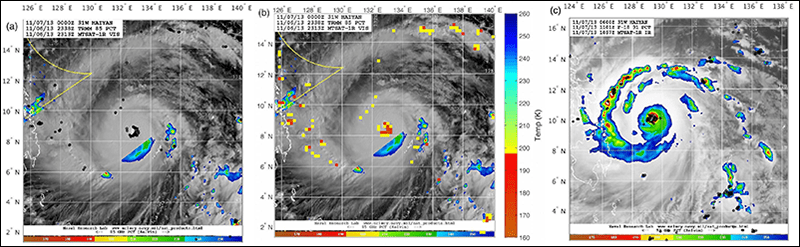

# Tropical Cyclone Intensity Estimation

  

## Table of Contents
1. [Description](#description)
2. [Information](#information)
3. [File descriptions](#files)
4. [Licensing](#licensing)

## Description

Tropical cyclone intensity estimation is a challenging task as it requires domain knowledge while extracting features, significant pre-processing, various sets of parameters obtained from satellites, and human intervention for analysis.

The inconsistency of results, significant pre-processing of data, the complexity of the problem domain, and problems on generalizability are some of the issues related to intensity estimation. In this project, we implemented a solution for categorizing hurricanes based on intensity using a deep convolutional neural network architecture trained on GPUs.

## Information

The contents of this repository were developed during the "NCC Portugal AI for Science Bootcamp" and are mainly a recreation of the Research Paper titled "Tropical Cyclone Intensity Estimation Using a Deep Convolutional Neural Network" by Ritesh Pradhan, Ramazan S. Aygun, Senior Member, IEEE, Manil Maskey, Member, IEEE, Rahul Ramachandran, Senior Member, IEEE, and Daniel J. Cecil.

The overall goals of this bootcamp were the following:
> - learn how to apply AI tools, techniques, and algorithms to real-life problems;
> - study the key concepts of Deep Neural Networks;
> - how to build Deep Learning models;
> - how to measure and improve the accuracy of your models;
> - learn essential data preprocessing techniques to ensure a robust machine learning pipeline.

Attendees were given access to a GPU cluster for the duration of the bootcamp.

## File descriptions

The description of the files in this repository can be found below:
- [Introduction, Motivation for the Problem;](https://github.com/HROlive/Tropical-Cyclone-Intensity-Estimation/blob/1fd8e20fb211048dbf3935ea0ba2d9d56dd9e91e//The_Problem_Statement.ipynb)
- [Approach the Problem, Understand and Pre-process the Dataset;](https://github.com/HROlive/Tropical-Cyclone-Intensity-Estimation/blob/1fd8e20fb211048dbf3935ea0ba2d9d56dd9e91e//Approach_to_the_Problem_&_Inspecting_and_Cleaning_the_Required_Data.ipynb)
- [Understand the Model Requirements, Annotation of Dataset, Train your Model;](https://github.com/HROlive/Tropical-Cyclone-Intensity-Estimation/blob/1fd8e20fb211048dbf3935ea0ba2d9d56dd9e91e//Manipulation_of_Image_Data_and_Category_Determination_using_Text_Data.ipynb)
- [Learn about improving the previous model, Data Augmentation, Tweaking Hyperparameters;](https://github.com/HROlive/Tropical-Cyclone-Intensity-Estimation/blob/1fd8e20fb211048dbf3935ea0ba2d9d56dd9e91e//Countering_Data_Imbalance.ipynb)
- [Competition;](https://github.com/HROlive/Tropical-Cyclone-Intensity-Estimation/blob/1fd8e20fb211048dbf3935ea0ba2d9d56dd9e91e//Competition.ipynb)
- [Introduction to Convolutional Neural Networks;](https://github.com/HROlive/Tropical-Cyclone-Intensity-Estimation/tree/1fd8e20fb211048dbf3935ea0ba2d9d56dd9e91e/Intro_to_DL)

## Licensing

This material is released by OpenACC-Standard.org, in collaboration with NVIDIA Corporation, under the Creative Commons Attribution 4.0 International (CC BY 4.0).
